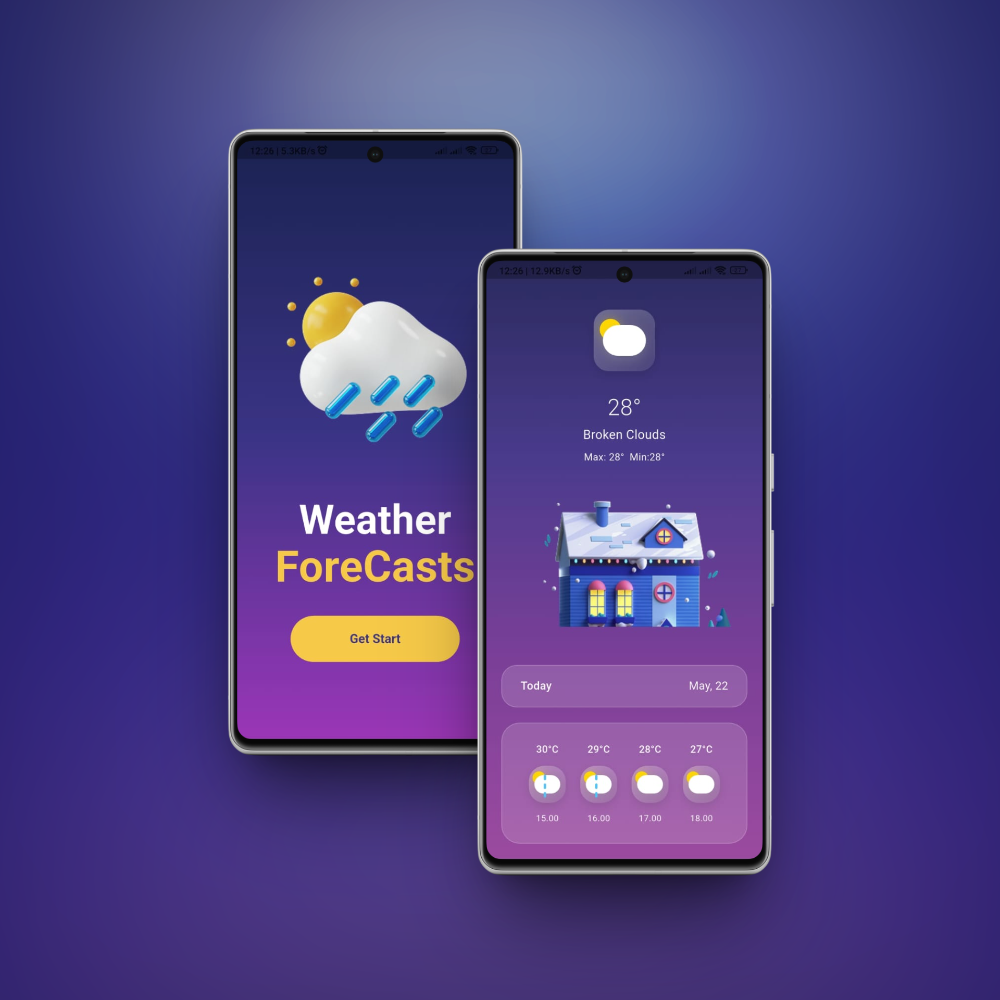

# 🌤️ Weather App

A modern, responsive weather application built with **Flutter**, delivering real-time weather data via the [OpenWeather API](https://openweathermap.org/). Developed with clean architecture principles, this app ensures high performance, modularity, and maintainability while following industry-standard best practices for security and user experience.

## 📱 Features

- 🌡️ Display current temperature, humidity, pressure, wind speed

## 🛠️ Tech Stack

- **Frontend**: Flutter (Dart)
- **State Management**: Provider
- **API Integration**: OpenWeather API (via HTTP package or Fetch-like abstraction)

## 🧰 Tools

- Flutter (UI Toolkit)
- Dart    (Programming Language)
- Logo    (AI Tools from Together.ai)

## 🤖 Ai Assistants

- Claudi
- ChatGPT

## 🖼️ Preview

## 📄 License

This project is licensed under the terms of the [MIT License](doc/README.md).